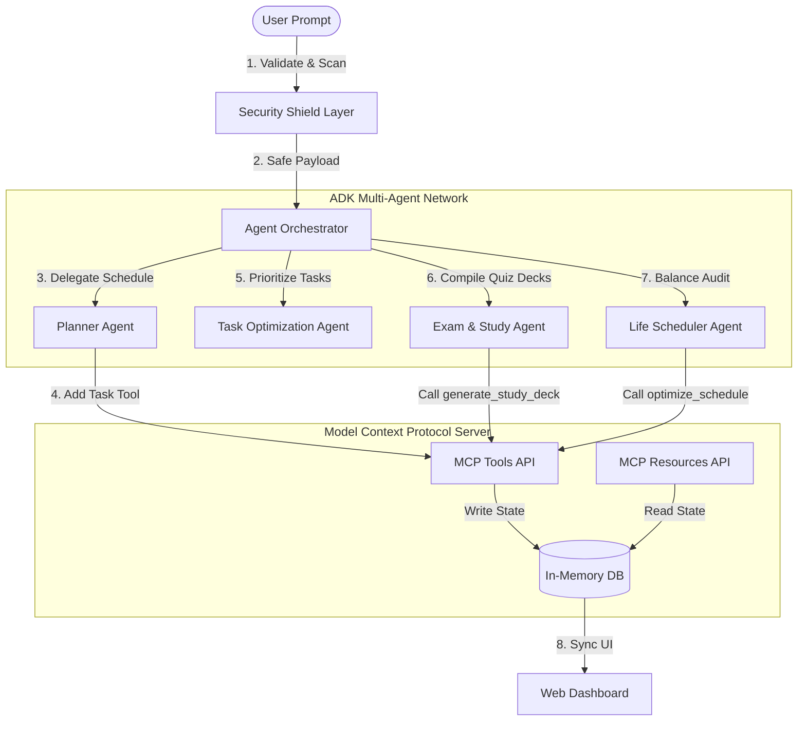

# security +Z ME AI

Here is a clean, visually structured breakdown of your components using emojis to make it instantly scannable and easy to understand.

---

# 🚀 Architecture Overview

## 🤖 1. ADK Multi-Agent System

A collaborative ecosystem where specialized AI agents work together as a team rather than relying on a single, massive model.

* 🧩 **Micro-Tasking:** Divides complex problems into smaller, manageable jobs.
* 🗣️ **Inter-Agent Comm:** Agents pass context and hand off tasks to one another seamlessly.
* ⚡ **Specialization:** One agent might code, another reviews, and a third deploys.

---
## 🔌 2. Model Context Protocol (MCP) Server

An open-standard universal bridge that connects AI models directly to your local data sources, development environments, and secure APIs.

* 🛠️ **Unified Tooling:** Eliminates the need to write custom integration code for every new tool.
* 📂 **Context Streaming:** Lets the AI securely read files, query databases, or execute safe commands in real time.
* 🔄 **Plug-and-Play:** A single protocol that lets any compliant LLM talk to any compliant data source.

---


## 🛡️ 3. Security Validation Shield

The real-time firewall and guardrail layer that sits between your AI agents and your infrastructure.

* 🚦 **Input Guard:** Intercepts malicious instructions, prompt injections, or unauthorized user overrides.
* 🔒 **Output Leak Prevention:** Stops sensitive credentials, private keys, or internal data from accidentally leaking out.
* 🚫 **Command Validation:** Ensures that actions requested by the AI (like deleting a file or calling a paid API) comply with your strict permission safety policies.

---

## 🗺️ How the Pipeline Flows

```
[🤖 ADK Multi-Agents] ──(Request Action)──> [🛡️ Security Shield] ──(Validated)──> [🔌 MCP Server] ──> [💻 Your Data/Tools]

```

---

## 🛠️ System Architecture




- **Planner Agent**: Deconstructs user input into study blocks and operational goals.
- **Task Optimization Agent**: Scores tasks by risk and importance, placing them in Eisenhower Matrix quadrants.
- **Exam/Study Agent**: Creates practice flashcards and active recall guides by calling the MCP server.
- **Life Scheduler Agent**: Monitors mental load, balances work-life ratios, and schedules mandatory cardio and wellness breaks.
- **Orchestrator**: Acts as the message broker, managing execution traces and handling agent communication telemetry.

### 2. Model Context Protocol (MCP) Server
The backend exposes a standard JSON-RPC interface and HTTP endpoints simulating an MCP Server:
- **Tools**:
  - `add_task`: Validates and appends a task.
  - `optimize_schedule`: Reallocates daily timeslots based on load metrics.
  - `generate_study_deck`: Creates flashcards and quiz questions.
  - `validate_study_material`: Runs deep sanitization on external materials.
- **Resources**:
  - `tasks://list`: Read registry of system and study goals.
  - `calendar://today`: Read hourly calendar blocks.
  - `security://status`: Read audit trace database.

### 3. Security Validation Shield
- **Input Validation**: Rejects commands with injection attempts (e.g. `;`, `|`, `&`, `$()`, backticks).
- **Path Traversal Shield**: Blocks directory path overrides (e.g. `../`).
- **Output Sanitization**: Utilizes HTML filters to strip scripts, custom iframe embeddings, and dangerous inline event handlers.
- **Sandbox Emulation**: Checks user-submitted script execution pipelines for global namespace or process references.

---


## 🚀 Setup & Execution

### Prerequisites
- Node.js installed on your machine.

### Installation
1. Clone this repository or open the workspace folder.
2. Open your terminal in the `security-z-me-ai` directory.
3. Install the dependencies:
   ```bash
   npm install
   ```

### Running the App
1. Start the Express server:
   ```bash
   npm start
   ```
2. Open your browser and navigate to:
   ```
   http://localhost:3000
   ```

---

## 🕹️ Antigravity End-to-End Demo Workflow

To experience the full capabilities of the multi-agent system, execute the following steps on the dashboard:

### Step 1: Normal Multi-Agent Planning Flow
1. Navigate to the **Agent Console** (💬 tab).
2. Enter the following prompt:
   ```text
   Prepare for CISSP Network Security quiz and configure my firewalls
   ```
3. Click **Solve Goal**.
4. **Observer Telemetry Logs (Right Panel)**: Watch the agents communicate:
   - *Planner Agent* analyzes the prompt and registers tasks on the MCP server.
   - *Task Optimization Agent* elevates security-critical tasks (firewalls) to the highest priority scoring.
   - *Exam Agent* calls `generate_study_deck` to load flashcard questions.
   - *Life Scheduler Agent* performs a wellness audit, injects wellness blocks into the daily calendar, and calls `optimize_schedule` to balance the timeline.
5. **View Final Output**: Read the custom formatted, sanitized report generated by the agents.
6. **Navigate Tabs**:
   - Check the **Priority Matrix** tab to see your tasks sorted into the Eisenhower Matrix.
   - Check the **Daily Calendar** tab to see the balance of study and rest timeslots.
   - Check the **Study Decks** tab to see the generated flashcards (click to flip).

### Step 2: Testing Security Enforcement (Injections)
1. Go back to the **Agent Console** (💬 tab).
2. Attempt a command injection attack by entering:
   ```text
   Review CISSP network protocols; rm -rf /etc/hosts
   ```
3. Click **Solve Goal**.
4. **Verify Shield Behavior**:
   - The UI immediately displays a red **Security Block Alert** notifying you that the request was intercepted.
   - Navigate to the **Security Audits** tab to inspect the audit log. You will find a `CHAT_BLOCKED` record with a `BLOCKED` status, documenting the threat detail.

### Step 3: Direct MCP Tool Interaction
1. Navigate to the **Priority Matrix** tab.
2. Scroll to the **Direct MCP Command Tool** form at the bottom.
3. Insert a task with a Title, Priority, and Category, and click **Call add_task**.
4. The task is validated, registered to the MCP server database, and immediately appears in the corresponding Eisenhower quadrant.
